# Skill Testing MOM6 Oxygen
Olivia Gemmell
2025-08-27

-   [Purpose](#purpose)
-   [Prepare Data](#prepare-data)
    -   [Process in situ data](#process-in-situ-data)
    -   [Create region polygons and add NOAA
        bathymetry](#create-region-polygons-and-add-noaa-bathymetry)
    -   [Prepare MOM6 data](#prepare-mom6-data)
-   [Nearest Neighbor Analysis](#nearest-neighbor-analysis)
    -   [Initial data checks](#initial-data-checks)
    -   [RMSE results](#rmse-results)
-   [Indivero Analysis](#indivero-analysis)
    -   [Initial data checks before model
        fitting](#initial-data-checks-before-model-fitting)
    -   [Model structure](#model-structure)
    -   [RMSE results](#rmse-results-1)
-   [Temporal trends](#temporal-trends)
-   [Confusion matrix](#confusion-matrix)
    -   [Indivero method](#indivero-method)
    -   [Nearest neighbor method](#nearest-neighbor-method)
-   [Conclusions](#conclusions)
-   [References](#references)

## Purpose

There is a lack of environmental data—particularly dissolved oxygen—at
the same temporal and spatial resolution as biological data, which can
limit species distribution analyses. Estimates from oceanographic models
can be used in place of direct in situ data, but their ability to
accurately represent in situ data remains untested. Here, we skill test
3D MOM6 oxygen data outputs against in situ [CTD
data](https://www.fisheries.noaa.gov/west-coast/science-data/oceanographic-and-ecosystem-sampling-during-pacific-hake-survey#measuring-conductivity-temperature-and-depth)
collected during the Joint U.S.-Canada Pacific Hake Acoustic Trawl
Survey following three methods:

1.  A nearest neighbour analysis

2.  Methodology from Indivero et al. (2025)

3.  A binary confusion matrix analysis

Using these methods, we evaluate the validity of MOM6 oxygen outputs for
use in age-structured short-term forecasts of Pacific hake.

## Prepare Data

### Process in situ data

First we process the in situ CTD data so it’s ready to use to calculate
RMSE. See 01-process_o2_obs.R for code.

    Rows: 220,357
    Columns: 15
    $ survey       <chr> "hake", "hake", "hake", "hake", "hake", "hake", "hake", "…
    $ year         <dbl> 2011, 2011, 2011, 2011, 2011, 2011, 2011, 2011, 2011, 201…
    $ month        <dbl> 8, 8, 8, 8, 8, 8, 8, 8, 8, 8, 8, 8, 8, 8, 8, 8, 8, 8, 8, …
    $ doy          <int> 222, 222, 222, 222, 222, 222, 222, 222, 222, 222, 222, 22…
    $ date         <dttm> 2011-08-11, 2011-08-11, 2011-08-11, 2011-08-11, 2011-08-…
    $ X            <dbl> 337.2117, 337.2117, 337.2117, 337.2117, 337.2117, 337.211…
    $ Y            <dbl> 5332.174, 5332.174, 5332.174, 5332.174, 5332.174, 5332.17…
    $ temp         <dbl> 14.7460, 14.7542, 14.7644, 14.5239, 12.9734, 12.4639, 12.…
    $ o2           <dbl> 285.0143, 281.9467, 271.9211, 250.1332, 235.7711, 231.910…
    $ salinity_psu <dbl> 31.1748, 31.1718, 31.1681, 31.2460, 31.6629, 31.7630, 31.…
    $ sigma0       <dbl> 23.08563, 23.08160, 23.07661, 23.18694, 23.82051, 23.9955…
    $ depth        <dbl> 2.975, 3.966, 4.958, 5.949, 6.941, 7.933, 8.924, 9.916, 1…
    $ longitude    <dbl> -125.1875, -125.1875, -125.1875, -125.1875, -125.1875, -1…
    $ latitude     <dbl> 48.122, 48.122, 48.122, 48.122, 48.122, 48.122, 48.122, 4…
    $ region       <chr> "bc", "bc", "bc", "bc", "bc", "bc", "bc", "bc", "bc", "bc…

### Create region polygons and add NOAA bathymetry

Next, we create region polygons and add NOAA bathymetry data for model
fitting later. We create separate regions for British Columbia and the
California Current but we will be focusing on the combined region that
includes both areas (i.e., “bc_cc”) for this anaylsis. We also restrict
the dataset to depths less than 500 m because the CTD casts only go that
deep. See 02-estimate_depths_by_region.R for code.

### Prepare MOM6 data

Then we prepare the MOM6 data for analysis. Here we grab 3D MOM6 oxygen
output from the [CEFI portal](https://psl.noaa.gov/cefi_portal/) by
year, convert it to a dataframe and match the format to the in situ data
(i.e., match column naming, convert o2 units etc.). See 03-prep_mom6.R
for code.

## Nearest Neighbor Analysis

We start our exploration by conducting a simple nearest neighbor (NN)
analysis to evaluate how well the regridded MOM6 output matches the in
situ data. We pull the MOM6 data at the same locations, times, and
depths as the in situ data. MOM6 data are interpolated using bilinear
interpolation between spatial point (lat, lon), and linear interpolation
between depths.

### Initial data checks

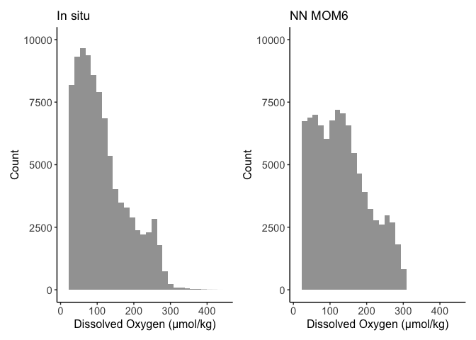

The data distributions look similar.

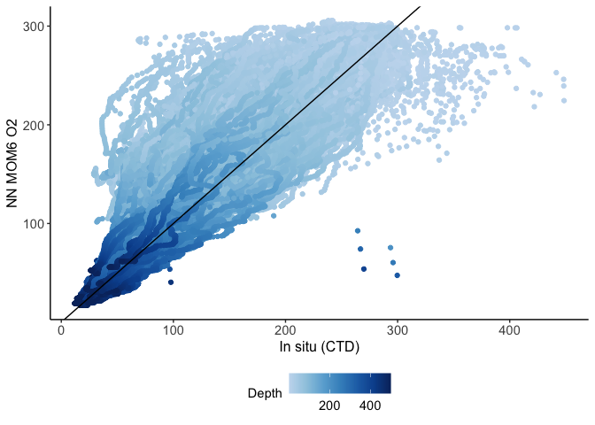

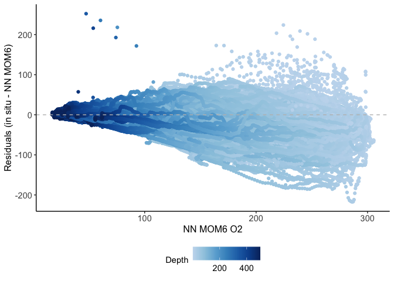

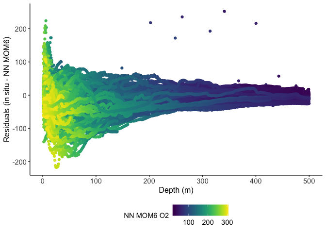

Overall, MOM6 tends to overestimate oxygen compared to in situ values
with greater overestimation at higher oxygen values and shallower
depths.

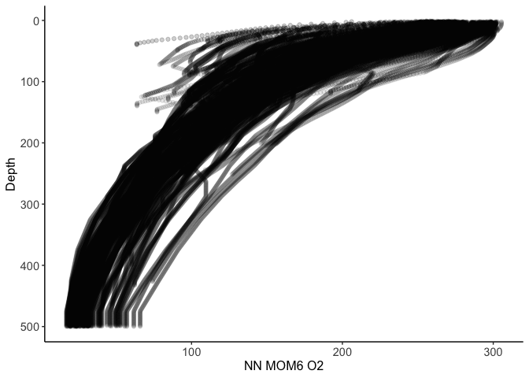

The extracted MOM6 values decrease with increasing depth, following the
expected oxygen and depth relationship.

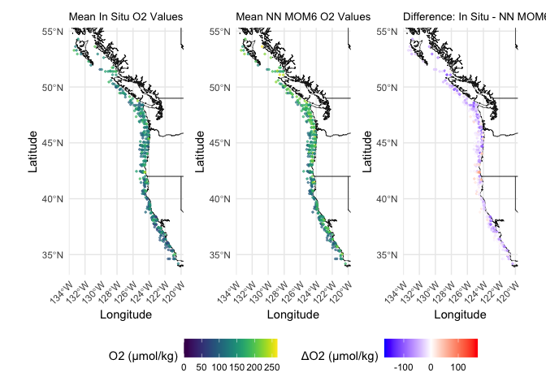

Looking at mean (i.e., averaged over all depth layers) spatial
differences, MOM6 tends to overestimate oxygen closer to the shoreline,
where the influence of shallower, more oxygenated depth layers is
greater.

### RMSE results

#### All data

Now let’s look at the RMSE results, first looking at results using all
the data combined.

    # A tibble: 4 × 2
       year  rmse
      <dbl> <dbl>
    1  2011  41.0
    2  2012  36.7
    3  2013  44.0
    4  2015  29.3

    [1] 37.61471

#### Hake oxygen preference boundary (o2 \< 119 µm/kg)

Let’s narrow the range of values to include only o2 values where hake
start showing altered behavior or distribution due to low oxygen
(Moriarty et al., 2020). In theory, large oxygen values need to be less
precise because they won’t influence distribution (i.e., we only need
precise O2 estimates at lower values when oxygen influences
distribution).

    # A tibble: 4 × 2
       year  rmse
      <dbl> <dbl>
    1  2011  40.1
    2  2012  35.3
    3  2013  42.0
    4  2015  21.1

    [1] 35.50725

#### Hake habitat (100-500 m)

Next let’s see how well oxygen values are predicted within hake habitat.

    # A tibble: 4 × 2
       year  rmse
      <dbl> <dbl>
    1  2011  30.3
    2  2012  26.6
    3  2013  26.6
    4  2015  20.6

    [1] 26.02717

And look at the spatial differences of the data within hake habitat
(i.e., excluding the mixed layer).

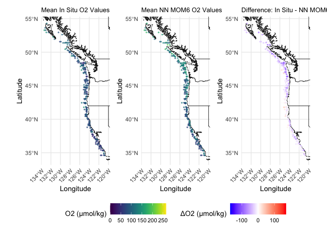

#### Hake forecast work (250-300 m)

And finally, lets narrow the depth range further to look at the range of
values we will focus on in our forecasting work.

    # A tibble: 4 × 2
       year  rmse
      <dbl> <dbl>
    1  2011  17.1
    2  2012  21.4
    3  2013  21.4
    4  2015  17.1

    [1] 18.68044

…and look at it spatially.

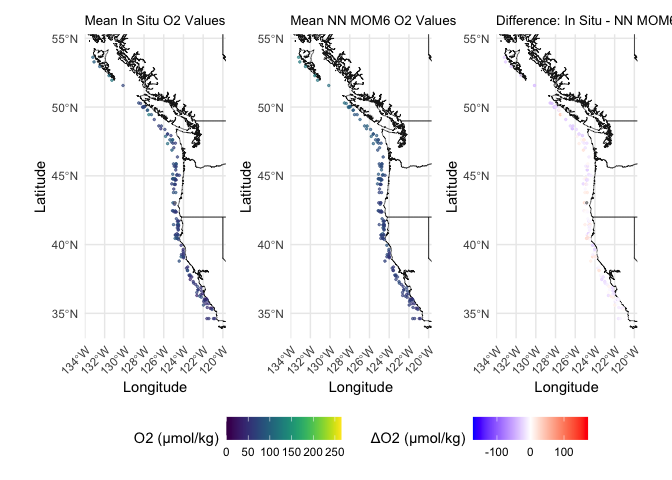

## Indivero Analysis

Then we conduct an analysis following methodology from Indivero et al.,
2025 to attempt to improve the skill of the MOM6 output. Here, we
extract MOM6 values at all vertical levels shallower than 500 m within a
specified region (e.g., bc_cc, bc, or cc), fit a spatial model to the
extracted MOM6 data, predict back to the location and depth of the in
situ data, and calculate RMSE to evaluate skill.

### Initial data checks before model fitting

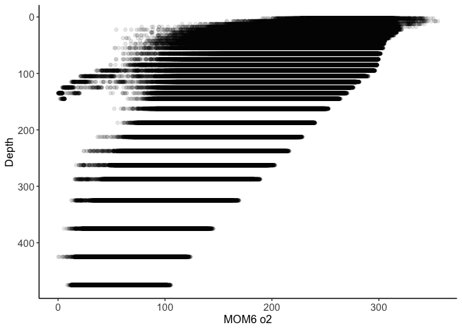

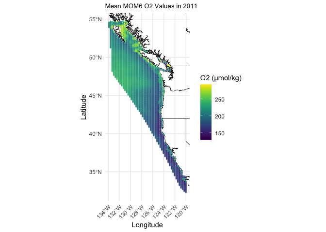

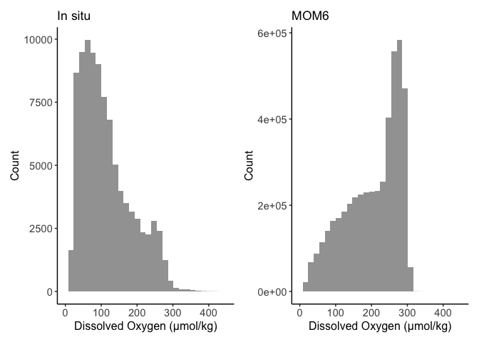

The data is left skewed but the Dharma residuals and model fit looked
fine so we will use it as is (i.e., untransformed).

### Model structure

    Spatial model fit by ML ['sdmTMB']
    Formula: o2 ~ 1 + s(depth_ln, k = 3) + as.factor(month)
    Mesh: spde (isotropic covariance)
    Data: region_dat
    Family: gaussian(link = 'identity')
     
    Conditional model:
                       coef.est coef.se
    (Intercept)            1.58    0.92
    as.factor(month)2      0.02    0.00
    as.factor(month)3      0.03    0.00
    as.factor(month)4      0.03    0.00
    as.factor(month)5      0.01    0.00
    as.factor(month)6     -0.03    0.00
    as.factor(month)7     -0.07    0.00
    as.factor(month)8     -0.09    0.00
    as.factor(month)9     -0.10    0.00
    as.factor(month)10    -0.11    0.00
    as.factor(month)11    -0.09    0.00
    as.factor(month)12    -0.05    0.00
    sdepth_ln             -0.52    0.00

    Smooth terms:
                 Std. Dev.
    sds(depth_ln      5.48

    Dispersion parameter: 0.22
    Matérn range: 1415.54
    Spatial SD: 0.93
    ML criterion at convergence: -106518.510

    See ?tidy.sdmTMB to extract these values as a data frame.

### RMSE results

#### All data

Now let’s look at the RMSE results, first looking at results using all
the data combined.

          mom6 n_test year
    1 53.80417  40408 2011
    2 39.84396  12912 2012
    3 36.73544  18187 2013
    4 31.82191  34914 2015

         rmse_total
    mom6    43.0656

#### Hake oxygen preference boundary (o2 \< 119 µm/kg)

Again, we narrow the range of values to include only O2 values where
hake start showing altered behavior or distribution due to low oxygen
(Moriarty et al., 2020)…

    # A tibble: 4 × 2
       year  rmse
      <dbl> <dbl>
    1  2011  54.3
    2  2012  39.5
    3  2013  36.8
    4  2015  31.2

    [1] 43.68179

#### Hake habitat (100-500 m)

…and see how well oxygen values are predicted within hake habitat…

    # A tibble: 4 × 2
       year  rmse
      <dbl> <dbl>
    1  2011  38.7
    2  2012  27.4
    3  2013  27.0
    4  2015  27.1

    [1] 31.64303

…looking at spatial distributions…

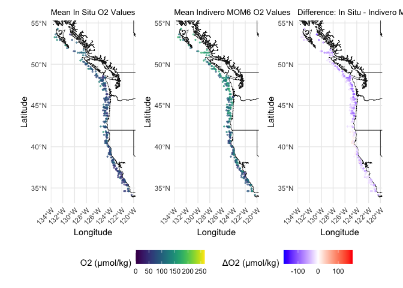

#### Hake forecast work (250-300 m)

…and finally, narrowing the depth range further to look at the range of
values we will focus on in our forecasting work…

    # A tibble: 4 × 2
       year  rmse
      <dbl> <dbl>
    1  2011  21.4
    2  2012  15.2
    3  2013  18.5
    4  2015  18.5

    [1] 19.30715

…and looking at it spatially.

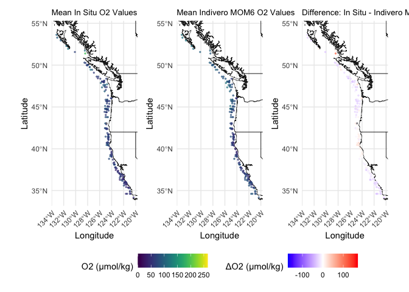

## Temporal trends

Next, lets see if the three scenarios align temporally (i.e., are they
following roughly the same trend through time) starting with trends on
an annual scale.

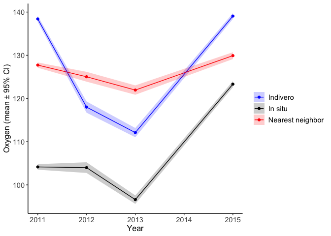

Here we can see trend shape similarities between all three scenarios
with the Indivero scenario deviating from the shape of the in situ trend
only in 2011 and the nearest neighbor scenario resembling a flattened
version of the in situ trend. Next let’s try adjusting the scale to a
year-month resolution.

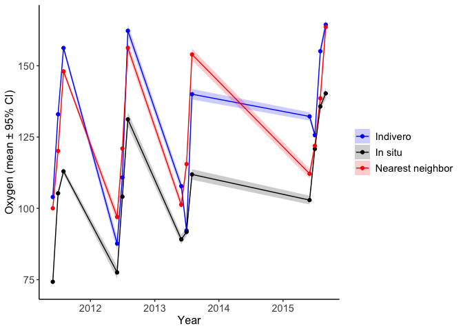

Here we can see that both analyses generally follow the same temporal
trend as the in situ scenario but with greater overall estimated values.
The nearest neighbor scenario estimates increasing O2 values as months
progress within each year which more closely resembles the trend of the
in situ data.

## Confusion matrix

Thinking about this from a slightly different angle, let’s simplify it
to a binary scenario and calculate some evaluation metrics based on a
confusion matrix. In this example we will label oxygen values less than
hakes oxygen preference boundary (i.e., 119 µm/kg) as 1, and oxygen
values greater than the preference boundary as 0.

### Indivero method

We’ll start by comparing in situ to the Indivero method first.

              Predicted
    Observed   Positive Negative
      Positive    33585      390
      Negative    15843    29005

From the confusion matrix we can see relatively low false positive rates
(390) and higher false negative rates (15843) indicating that the model
is overpredicting oxygen values, which mirrors what we saw in the
analysis above.

    [1] "True Skill Statistic"

    [1] 0.6662056

    [1] "Matthews Correlation Coefficient"

    [1] 0.6505494

Finally, we can calculate True Skill Statistic and Matthews Correlation
Coefficent evaluation metrics that account for class imbalances. Both
range from -1 (inverse prediction) to 1 (perfect prediction) with 0
indicating classification no better than random. There isn’t a single
universal cutoff for values that are considered acceptable, but in
practice, TSS and MCC values of 0-0.2 are considered very weak, 0.2-0.4
have weak to moderate skill, 0.4-0.6 have moderate to good skill,
0.6-0.8 have strong skill, and 0.8 to 1.0 have near perfect skill. Both
our TSS and MCC values fall within the strong skill range suggesting a
strong, reliable classification model.

### Nearest neighbor method

Then we compare in situ to the nearest neighbor method.

              Predicted
    Observed   Positive Negative
      Positive    37417     1369
      Negative    12011    28026

From the confusion matrix we can see relatively low false positive rates
(1369) and higher false negative rates (12011) indicating that the model
is overpredicting oxygen values, which mirrors what we saw in the
analysis above.

    [1] "True Skill Statistic"

    [1] 0.7104275

    [1] "Matthews Correlation Coefficient"

    [1] 0.6871867

And again, both our TSS and MCC values fall within the strong skill
range suggesting a strong, reliable classification model.

## Conclusions

Our evaluation indicates that the regridded MOM6 output (i.e., the
nearest neighbor method) is suitable for inclusion in the forecasting
model. The nearest neighbor method consistently outperformed the
Indivero method across all RMSE comparisons, reproduced temporal trends
observed in the in situ data, and demonstrated strong predictive skill
in the binary framework (TSS and MCC). RMSE values at the focal depths
of the forecasting analysis were within an acceptable range (15–20;
Indivero, pers. comm., 2025-08-22). While MOM6 tended to overestimate
oxygen concentrations in shallower waters, these biases occurred
primarily above the oxygen preference boundary, as reflected by the
lower false-positive rate (n = 1369), and are unlikely to influence hake
distribution. More importantly, however, MOM6 also overestimated oxygen
at depths of ~100–200 m, where oxygen values may be lower than the
preference boundary value, which could lead to localized overprediction
of hake biomass in the forecast model.

## References

Indivero, Julia, Sean C. Anderson, Lewis A. K. Barnett, John E. Pohl,
Sean K. Rohan, Samantha Siedlecki, Eric J. Ward, and Timothy E.
Essington. 2025. “Skill Testing Oxygen Data for Distribution Modeling of
Marine Species.” *Fisheries Oceanography*.
<https://doi.org/10.1111/fog.70005>.
